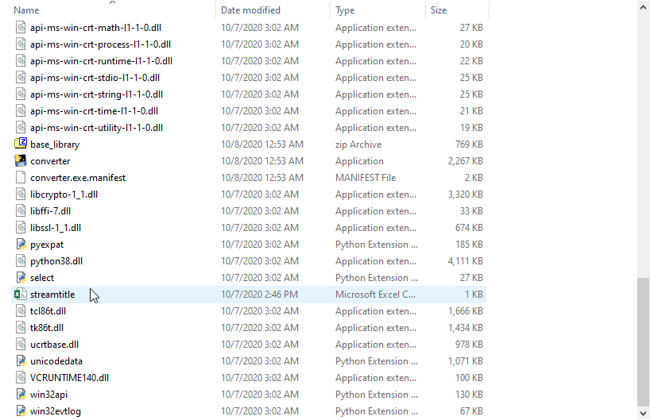
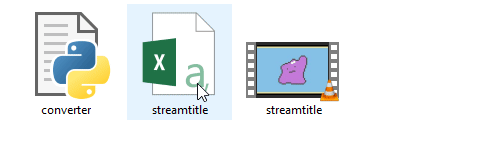
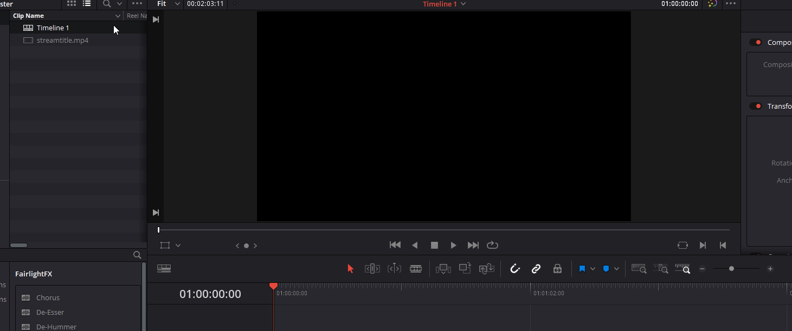

# Twitch marker importer 4 DaVinci Resolve
Twitch marker importer 4 DaVinci Resolve converts twitch's csv file for stream markers into a edl file which DaVinci Resolve can import onto a project's timeline. 

## Features
- includes description and creator of the marker in the markers created in DaVinci Resolve

# Usage
1. Rename csv file to something appropriate as the program will output the file "csv's filename markers"
2. Drag and drop csv file onto "converter.py" or "converter.exe"
3. Import resulting edl file onto the timeline

Using the compiled version

Using the python script version

Importing edl file onto a timeline

# Todo
- [ ] apply markers directly to individual files rather than entire timeline
- [ ] allow for batch convert of csv files
- [ ] support for other editors